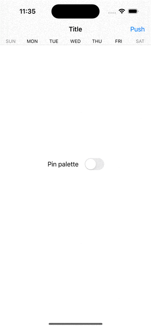

# navigation-bar-palette
This example project demonstrates how to add a custom view to the bottom of the navigation bar, similar to Apple's Calendar app.  

It utilizes an Objective-C dummy class that acts as an instance of private `_UINavigationBarPalette` class, and a `UINavigationItem` category to expose a private property to update the palette.  

